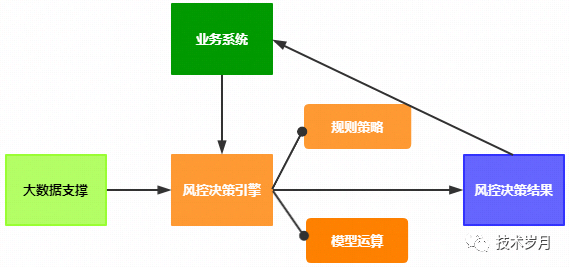
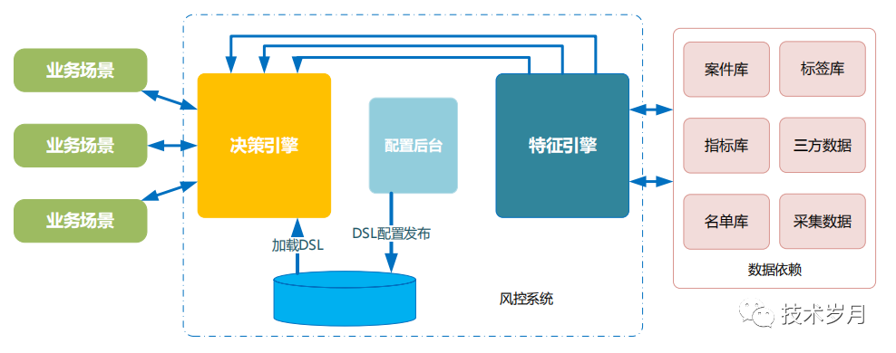

# 风控决策引擎系统
### I.决策引擎系统介绍

风控决策引擎系统是在大数据支撑下，根据行业专家经验制定规则策略、以及机器学习/深度学习/AI领域建立的模型运算，对当前的业务风险进行全面的评估，并给出决策结果的一套系统。

决策引擎，常用于金融反欺诈、金融信审等互金领域，由于黑产、羊毛党行业的盛行，风控决策引擎在电商、支付、游戏、社交等领域也有了长足的发展，刷单、套现、作弊，凡是和钱相关的业务都离不开风控决策引擎系统的支持保障。决策引擎和规则引擎比较接近（严格说决策引擎包含规则引擎，之前也有叫专家系统，推理引擎），它实现了业务决策与程序代码的分离。

一套商业决策引擎系统动辄百万而且需要不断加钱定制，大多数企业最终仍会走上自研道路，市场上有些开源规则引擎项目可参考，比较出名的开源规则引擎有drools、urule，都是基于Rete算法，都是基于java代码实现，一些企业会进行二次开发落地生产。而这类引擎功能强大但也比较“笨重”，易用性以及定制性并不够好，对其他语言栈二次开发困难。今天我们对决策引擎进行抽象建模，一步步打造一套简单实用的实现，这里会基于golang语言进行实现。

关于如何实现决策引擎的文章市面极少见，实践生产落地的经验分享也基本没有。我会结合工作实践及个人思考，从业务抽象建模，产品逻辑规划以及最终技术架构和代码实现等方面给出全方位的解决方案。

### 决策引擎架构图

### 阅读全文链接
[智能风控决策引擎系统可落地实现方案（一）规则引擎实现](https://mp.weixin.qq.com/s?__biz=MzIyMzMxNjYwNw==&mid=2247483738&idx=1&sn=111609f176f11de8357c51a820b089b5&chksm=e8215e4adf56d75c2e6e8b81b89c1faabab667f493ce809cb749994cc9cd776342fd17d4172e&token=227666410&lang=zh_CN#rd)

[智能风控决策引擎系统可落地实现方案（二）决策流实现](https://mp.weixin.qq.com/s?__biz=MzIyMzMxNjYwNw==&mid=2247483770&idx=1&sn=3166a6617ddb6b628261b8b7ff84cfac&chksm=e8215e6adf56d77cb76de41b63e63759221932f030e315acebbc4025939b2e02b354a9072ecc&scene=178#rd)

[智能风控决策引擎系统可落地实现方案（三）模型引擎实现](https://mp.weixin.qq.com/s?__biz=MzIyMzMxNjYwNw==&mid=2247483789&idx=1&sn=ddb5f31edfd3174d4551fecc3f120f42&chksm=e8215e9ddf56d78b520f7ab5c8db7e978b3078a1e2511d424ff272ac6c509fd4c13d893dfc09&token=1795265687&lang=zh_CN#rd)

[智能风控决策引擎系统可落地实现方案（四）风控决策实现](https://mp.weixin.qq.com/s?__biz=MzIyMzMxNjYwNw==&mid=2247483825&idx=1&sn=3ebf7c8ad42f870e48db56ca6bb99ade&chksm=e8215ea1df56d7b7d9b1c653c61ef011d72d46d090845d91deba39f635d03ce1282eaa433485&token=1795265687&lang=zh_CN#rd)

扫码关注微信订阅号支持：

